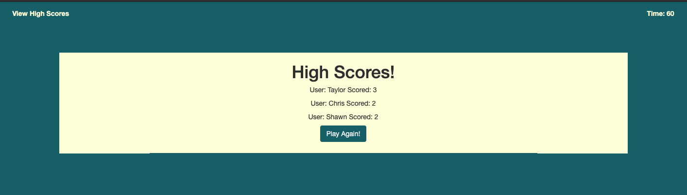
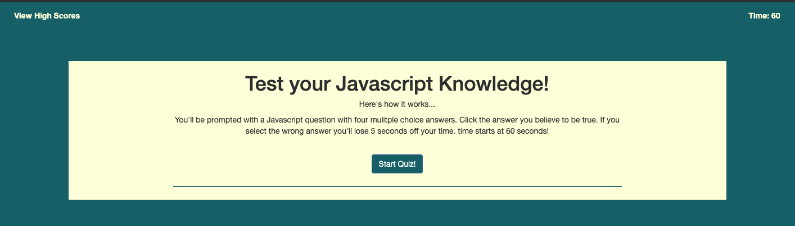

# quiz-game

This API is useful for anyone trying to Build a timed quiz with multiple-choice questions. This app will run in the browser and feature dynamically updated HTML and CSS powered by your JavaScript code. It also features a clean and polished user interface and is responsive, ensuring that it adapts to multiple screen sizes.

feel free to update the questions here with as many questions as you need or change the existing questions to meet your needs!

## General flow

GIVEN I am taking a code quiz
WHEN I click the start button
THEN a timer starts and I am presented with a question
WHEN I answer a question
THEN I am presented with another question
WHEN I answer a question incorrectly
THEN time is subtracted from the clock
WHEN all questions are answered or the timer reaches 0
THEN the game is over
WHEN the game is over
THEN I can save my initials and score

## User Guide

Below is an image of the homescreen users will start with. Users will be able to click "Start Quiz!" to begin taking the quiz. Everything on this page is established in the html

Below is an image of the highscore screen users will see after they complete the quiz. Users will be able to see all of their high scores even after refreshing the page becasue we are pushing the data to local storage

© 2019 Matt Milici, All Rights Reserved.
